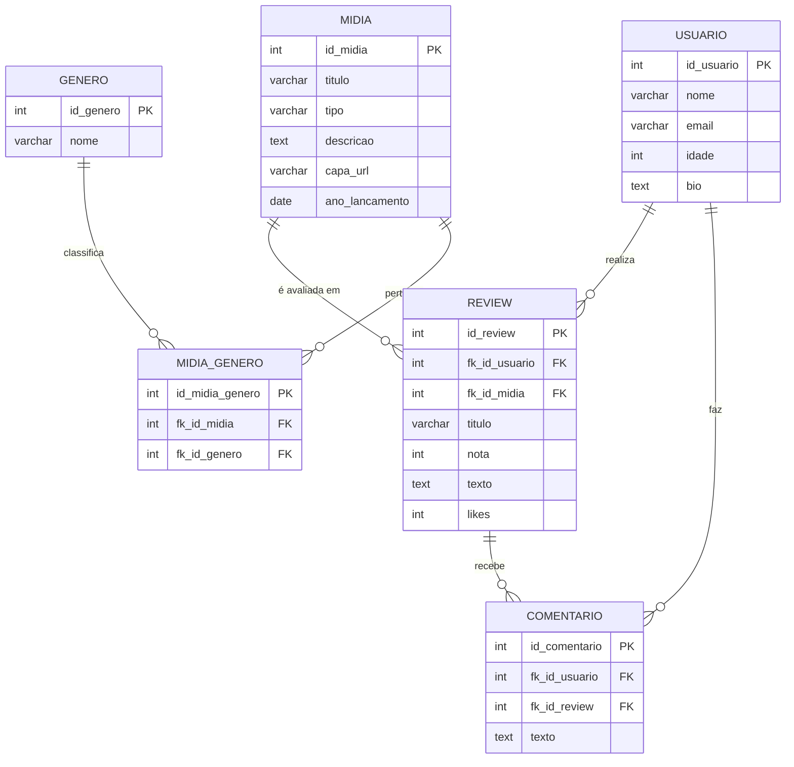

# 🎬 Rede Social de Mídia

Uma aplicação web desenvolvida com **Streamlit (frontend)** e **Supabase (backend)** que funciona como uma **rede social de reviews de mídias** — onde usuários podem criar contas, avaliar filmes, séries, livros e jogos, e interagir por meio de comentários.

---

## 🚀 **Funcionalidades Principais**

- 👤 Cadastro e login de usuários  
- 📝 Criação e visualização de *reviews* (avaliações)  
- 💬 Sistema de comentários  
- ❤️ Likes em reviews  
- 🔍 Pesquisa avançada por usuários e reviews (com filtros por nome, gênero e tipo de mídia)  
- 📊 Interface moderna e responsiva com **Streamlit**

---

## 🧠 **Tecnologias Utilizadas**

| Camada | Tecnologia | Descrição |
|--------|-------------|-----------|
| Frontend | **Streamlit** | Interface web interativa e dinâmica |
| Backend | **Supabase** | Gerenciamento do banco de dados e autenticação |
| Banco de Dados | **PostgreSQL (via Supabase)** | Armazenamento dos dados de usuários, mídias, reviews e comentários |
| Linguagem | **Python 3.13+** | Lógica da aplicação e integração com o Supabase |

---

## 🧩 **Modelo Lógico do Banco de Dados (Mermaid)**

## **Links:**

deploy:  https://projeto-rede-social-rwu4ftnrsgqkaqy9mkjag9.streamlit.app/perfilUsuario

vídeo de apresentação: https://youtu.be/WX1rw7S96P8
